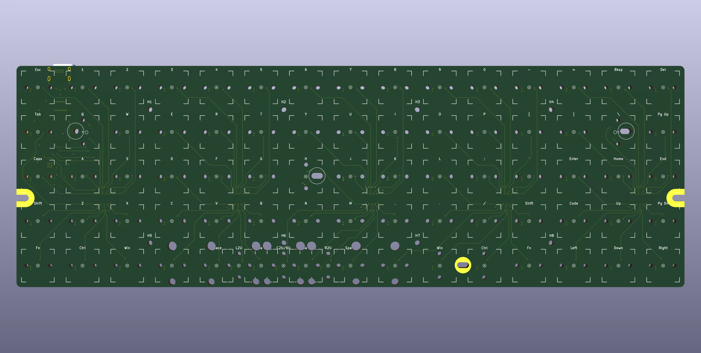
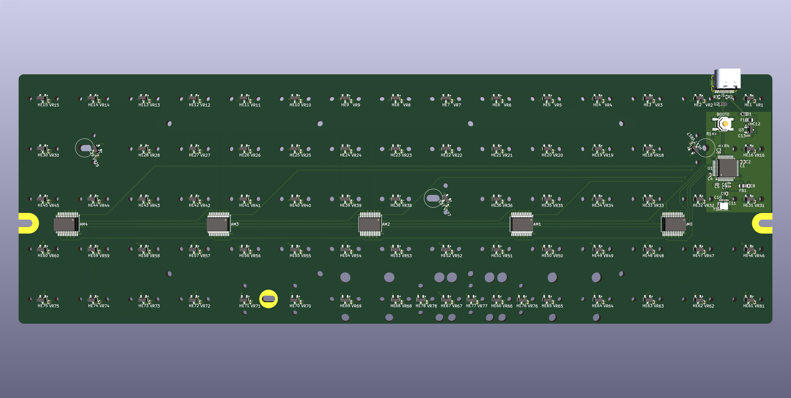
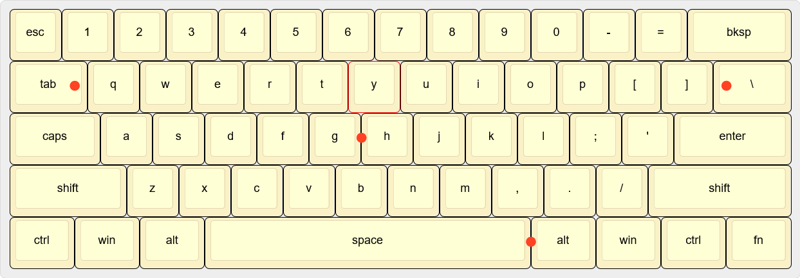

# HE75

A standard 60% kebyoard (GH60 compatible) with 75 hall effects keys and an ortholinear layout.

, which I used heavily for routing patterns, schematic design, and even to find code to program QMK.
- [Void Switch 65%](https://github.com/riskable/void_switch_65_pct) (and the 2 begining videos [part 1](https://www.youtube.com/watch?v=TfKz_FbZWLQ) and [part 2](https://www.youtube.com/watch?v=sFR6E_Ejot0)), for giving me a starting point.
- [HE8](https://github.com/peppapighs/HE8) (and his [writeup](https://old.reddit.com/r/MechanicalKeyboards/comments/1glk0dc/i_made_a_hall_effect_macropad_long_writeup_below/)) to confirm components work.

I also used a few community assets to start the design:
- https://github.com/ebastler/marbastlib for switches and stabalizers footprints.
- https://github.com/ai03-2725/JP60 for an up-to-date GH60 shell layout.

# Constraints while designing

1. Must fit into a 60% keyboard case
2. Must use an ortholinear layout
3. Should use hall effect keys

The first two are my real requirements. I bought a [Wooting 60HE module](https://wooting.io/wooting-60he-module) and case, but I just can't stand the standard keyboard layout after using a split-ortho board for years. This is my attempt to cram an ortholinear layout into the same case, and hopefully keep the fancy hall effect sensing for gaming.

The first major issue is mouting positions for GH60 keyboards (marked in red):

When putting an ortholinear layout over top of that, several of the conflict:

[][https://www.keyboard-layout-editor.com/#/gists/17eab835f870a1f1875c20cea78cf165]

This is a little bit of a problem when using standard MX keyswitches, the screws used to mount the board will prevent the keyswitch from fully inserting. Normally you'd just leave those screws out, and still use the mount point for support. But with a hall effect keyboard, there's a hall effect sensor on the backside of the PCB and we need to move it so that it doesn't short out or get damaged when inserting the keyboard into the case. So for three keys (Q, H, and \), the sensor is roughly 1mm out of alignment with the keyswitch's magnet. Hopefully this'll be ok.

Even trying different ortholinear keyboard layouts won't fully solve this (like the . There's just no way to have a 1u aligned grid that doesn't have some conflict.

# Next Steps

I haven't ordered the first set of boards yet. JLCPCB estimates $47 for the first 5 PCBs, and $142 to get them assembled. I'm hoping someone will review the design before I send it off, I'm very new to this.